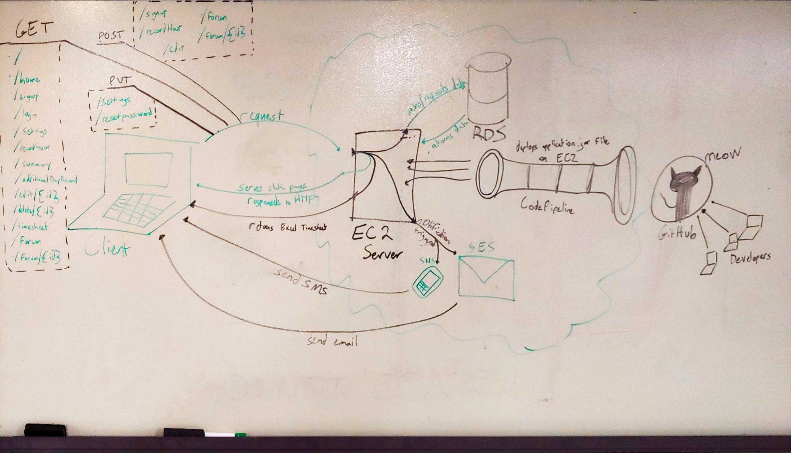

# ApprentiDash v2 - Team Queue 

This is a project designed to help apprentices clock their hours for OJT. 
Current repo is forked off from [older version](https://github.com/team-queue/apprenti-dash).

Can also be used for any general timesheet needs. 

You can find the live deployment [here](http://finalprojectapprentidashboard-env.4gepw3ap4a.us-west-2.elasticbeanstalk.com).

You can find our mock press release [here](./PressRelease.md) 

#### Developers
- [Paula Thomas](https://github.com/Paula9t9)
- [Yuan Gao](https://github.com/ygao0719)
- [Peter Tynan](https://github.com/pettynan)
- [Reina Vencer](https://github.com/river-ceanne)

#### Technologies Used
- AWS RDS
- AWS Elastic Beanstalk
- AWS EC2
- AWS Cloudwatch
- AWS Code Pipeline
- AWS SNS
- AWS SES
- SpringBoot MVC
- Thymeleaf
- Bootstrap

## Architecture/Data-Flow

## CI/CD - Deployment Process
We have partially automated our deployment process using CodePipeline to listen to changes on the master branch of our GitHub repo. However, we are still manually building the application.jar file used by EB. These are the steps we took each time we deployed our current working (Development) branch.
1. Merge all working branches into the development branch.
2. Pull development branch, test to make sure the app is working.
3. Edit application.properties, comment in/out the appropriate lines for deployed app vs. running app locally.
4. In console, run ./gradlew bootJar
5. Copy /build/libs/application.jar into the root level of the repo, replacing the old application.jar file there.
6. Merge these changes back into the GitHub development branch.
7. Merge Github development branch into GitHub master branch. Now, CodePipeline will detect the changes to master branch, pass the repo to EB, and EB will deploy the new application.jar file to an EC2 instance.
8. Finally, everybody pulls master to master on their local machines, and pulls development to development to avoid merge conflicts.

## Features

#### Full Authentication: 
Log in and have access to all your timesheet data. 

#### Clock-In/Out/And In Between

Using a single button press, users can clock in, clock out, and clock their lunch ours. 

#### View Your Hours

Our summary page displays all your timesheet data for easy reference. 

#### Edit Your Hours

Forgot to Clock In? Need to adjust your hours? You can fully edit all of your timesheet data.

#### Download a CSV File

From the summary page, users can download a csv file of their clock-in times and hours for their chosen date range. 

#### Edit User Settings
Ability to edit and update your user information such as firstname, lastname, email, phone number, and manager name.

#### Create a Discussion Topic
Users can post a discussion topic / question to other users for help on processes of the program.

#### Comment on a Discussion
Users can comment on a thread / discussion to help other users.

## Instructions

The easiest way is use our app is via our [live deployment](http://apprenti.us-west-2.elasticbeanstalk.com/).

Simply create an account and you're good to go!

### How to run app locally:

If you want to fork our code and use it for your own project, you will need to take a few steps after cloning the repo. 

1) Create a local psql Database named "apprenti"

    (No need to set up tables, our app will take care of that.)
    
2) Set environment variables for the application properties. 

    For example, to run locally you can set the DATABASE_URL to
        
        jdbc:postgresql://localhost:5432/apprenti 
      
    Username and Password may also be required if you are running on a Windows PC. 
    
    For example: 
    
        
        spring.datasource.url=${DATABASE_URL}
        spring.datasource.username=${DATABASE_USERNAME}
        spring.datasource.password=${DATABASE_PASSWORD}
    
   Set your username and password according to your psql settings. 
    
3) Build and run

4) Open your browser to localhost:8080 (The Spring default) 
   
   
   
   

